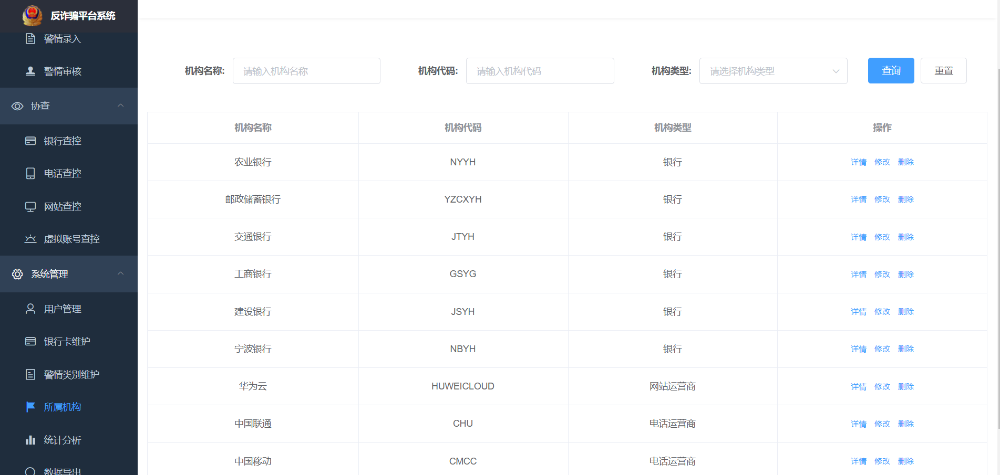

# 基于Vue2和Node.js的反欺诈系统设计与实现

最近包工头喊农民工小郑搬砖，小郑搬完砖后沉思片刻，决定写篇小作文分享下，作为一个初学者的全栈项目，去学习它的搭建，到落地，再到部署维护，是非常好的。

​																																																					      ------题记

## 写在前面

通过本文的学习，你可以学到

* vue2、element ui、vue-element-admin在前端的使用
* 组件设计
* echarts在前端中的使用
* eggjs在后端node项目中的使用
* docker一键化部署

## 需求分析

### 背景

近些年，网络诈骗案频发，有假扮家里茶叶滞销的茶花女，有假扮和男朋友分手去山区支教的女教师，有告知你中了非常6+1的大奖主持人，有假扮越南那边过来结婚的妹子，各类案件层出不穷。作为公民，我们应该在社会主义新时代下积极学习组织上宣传反诈骗知识，提高防范意识。除此之外，对于种种诈骗案件，是网站的我们就应该封其网站，是电话的我们就应该封其电话，是银行的我们就该封其银行账号，是虚拟账号的我们就应该封其虚拟账号。我相信，在我们的不懈努力之下，我们的社会将会更和谐更美好！

### 需求

长话短说，需求大致是这样子的：有管理员、市局接警员、县区局接警员、电话追查专员、网站追查专员、银行追查专员、虚拟账号专员这几类角色， 相关的角色可以进入相关的页面进行相关的操作，其中市局和管理员的警情录入是不需要审核，直接派单下去，而县区局的警情录入需要进行审核。当审核通过后，会进行相应的派单。各类追查员将结果反馈给该警单。系统管理员这边还可以进行人员、机构、警情类别，银行卡、数据统计、导出等功能。希望是越快越好，越简单越好，领导要看的。

部分效果如图：

<center>


</center>
<center>


</center>


## 技术预研

这个项目不是很大，复杂度也不是很高，并发量也不会太大，毕竟是部署在public police network下的。所以我这边选用vue2，结合花裤衩大佬的vue-element-admin，前端这边就差不多了，后端这边用的是阿里开源的eggjs，因为它使用起来很方便。数据库用的是mysql。部署这边提供了两套方案，一套是传统的nginx、mysql、node、一个一个单独安装配置。另一种是docker部署的方式。

## 功能实现

### 前端

#### vue代码规范

参见：https://www.yuque.com/ng46ql/tynary

#### vue工程目录结构

参见：https://panjiachen.gitee.io/vue-element-admin-site/zh/guide/#%E7%9B%AE%E5%BD%95%E7%BB%93%E6%9E%84

#### vue组件设计与封装

这里我选了几个有代表性的典型的组件来讲解，我们先来看一张图找找组件设计和封装的感觉。


通过观察我们发现，在后台管理界面中，蛮多的页面是长这样子的，我们不可能来一个页面我们就再写一次布局，这样人都要搞没掉。所以我们会有想法地把它封装成一个`container.vue`,它主要包含头部的标题和右边的新增按钮、中间的过滤面板以及下方的表格。

`container.vue`是一个布局组件，它主要是框定了你一个页面大致的布局， 在适当的位置，我们加入插槽`slot`去表示这块未知的区域，`container.vue`代码实现如下：

```vue
<template>
  <div>
    <el-row class="top">
      <el-col :span="24">
        <el-row>
          <el-col :span="12">
            <div
              v-if="title"
              class="title"
            >
              {{ title }}
            </div>
          </el-col>
          <el-col
            :span="12"
            class="btn-group"
          >
            <slot name="topExtra" />
            <el-col />
          </el-col>
        </el-row>
      </el-col>
      <el-col :span="24">
        <slot name="tab" />
      </el-col>
    </el-row>
    <div class="content">
      <slot name="content" />
    </div>
  </div>
</template>

<script>
export default {
  name: 'CommonContainer',
  props: {
    title: { type: String, default: '' }
  }
}
</script>

<style lang="scss" scoped>
.top {
  padding: 15px;
  min-height: 100px;
  background-color: #fff;
  box-shadow: 0 3px 5px -3px rgba(0, 0, 0, 0.1);
}

.title-box {
  height: 100px;
  line-height: 100px;
  display: flex;
  justify-content: space-between;
  align-items: center;
}

.title {
  font-size: 30px;
  font-weight: 700;
}
.content {
  margin: 20px 5px 0;
  padding: 20px 10px;
  background: #fff;
}

.btn-group {
  text-align: right;
  padding: 0 10px;
}
</style>

```

往下走，我们会想到怎么去设计表格这个组件，在设计这个组件的时候，我们需要清楚的知道，这个组件的输入以及输出是什么？比如说`table-query.vue`这个组件，从名字我们能够看出，它是有查询请求的，那么对于请求，很容易抽象出的一些东西是，请求地址，请求参数，请求方法等等，所以这边的props大致可以这么敲定。

```javascript
props: {
    // 请求表格数据的url地址
    url: { type: String, required: true },
    // 默认分页数
    pageSize: { type: Number, default: 10 },
    // 是否展示序号
    index: { type: Boolean, default: true },
    // 表格的列的结构
    columns: { type: Array, required: true },
    orgId: { type: String, required: false, default: '' },
    // 请求表格数据的方法
    method: { type: String, default: 'post' },
    // 请求表格数据的参数
    params: { type: Object, default: () => ({}) },
    // 是否支持高亮选中
    isHighlightRow: { type: Boolean, default: false },
    // 是否显示分页
    isShowPagination: { type: Boolean, default: true },
    // 是否显示迷你分页
    isPaginationSizeSmall: { type: Boolean, default: false }
  },
```

这里的输出，我们期望的是，当用户点击详情、查看、删除的时候，我要知道这一行的具体数据，那么大致可以这么敲定。

```javascript
 handleClick(row, type, title) {
    this.$emit('click-action', row, type, title)
 },
```

这边作为组件的数据通信已经敲定了，剩下的也就是一些封装请求的逻辑，页面交互的逻辑，具体地可以看一下`table-query.vue`的实现

```vue
<template>
  <div>
    <el-table
      ref="table"
      border
      :data="data"
      :loading="isLoading"
      :highlight-row="isHighlightRow"
      :row-class-name="tableRowClassName"
    >
      <template v-for="column in columns">
        <template v-if="column.key === 'actions'">
          <el-table-column
            :key="column.key"
            align="center"
            :width="column.width"
            :label="column.title"
          >
            <template slot-scope="scope">
              <el-button
                v-for="action in filterOperate(
                  column.actions,
                  scope.row.btnList
                )"
                :key="action.type"
                type="text"
                size="small"
                @click="handleClick(scope.row, action.type, action.title)"
              >{{ action.title }}</el-button>
            </template>
          </el-table-column>
        </template>
        <template v-else-if="column.key === 'NO'">
          <el-table-column
            :key="column.key"
            type="index"
            width="80"
            align="center"
            :label="column.title"
          />
        </template>
        <template v-else>
          <el-table-column
            :key="column.key"
            align="center"
            :prop="column.key"
            :width="column.width"
            :label="column.title"
            :formatter="column.formatter"
            :show-overflow-tooltip="true"
          />
        </template>
      </template>
    </el-table>
    <el-row type="flex" justify="center" style="margin-top: 10px;">
      <el-col :span="24">
        <el-pagination
          v-if="isShowPagination"
          :small="true"
          :total="total"
          :background="true"
          :page-sizes="pageSizeOptions"
          :current-page="pagination.page"
          :page-size="pagination.pageSize"
          @current-change="changePage"
          @size-change="changePageSize"
        />
      </el-col>
    </el-row>
  </div>
</template>

<script>
import request from '@/utils/request'
import { getLength } from '@/utils/tools'

export default {
  name: 'CommonTableQuery',
  props: {
    // 请求表格数据的url地址
    url: { type: String, required: true },
    // 默认分页数
    pageSize: { type: Number, default: 10 },
    // 是否展示序号
    index: { type: Boolean, default: true },
    // 表格的列的结构
    columns: { type: Array, required: true },
    orgId: { type: String, required: false, default: '' },
    // 请求表格数据的方法
    method: { type: String, default: 'post' },
    // 请求表格数据的参数
    params: { type: Object, default: () => ({}) },
    // 是否支持高亮选中
    isHighlightRow: { type: Boolean, default: false },
    // 是否显示分页
    isShowPagination: { type: Boolean, default: true },
    // 是否显示迷你分页
    isPaginationSizeSmall: { type: Boolean, default: false }
  },
  data() {
    return {
      // 表格的行
      data: [],
      // 分页总数
      total: 0,
      // 表格数据是否加载
      isLoading: false,
      // 是否全选
      isSelectAll: false,
      // 渲染后的列数据字段
      renderColumns: [],
      // 分页
      pagination: {
        page: 1,
        pageSize: this.pageSize
      }
    }
  },
  computed: {
    // 是否有数据
    hasData() {
      return getLength(this.data) > 0
    },
    // 分页条数
    pageSizeOptions() {
      return this.isPaginationSizeSmall ? [10, 20, 30] : [10, 20, 30, 50, 100]
    }
  },
  created() {
    this.getTableData()
  },
  methods: {
    tableRowClassName({ row, rowIndex }) {
      // if (rowIndex === 1) {
      //   return 'warning-row'
      // } else if (rowIndex === 3) {
      //   return 'success-row'
      // }
      if (row.alarmNo && row.alarmNo.startsWith('FZYG')) {
        return 'warning-row'
      }
      return ''
    },
    // 改变分页
    changePage(page) {
      this.pagination.page = page
      this.getTableData()
    },
    // 改变分页大小
    changePageSize(pageSize) {
      this.pagination.pageSize = pageSize
      this.getTableData()
    },
    // 获取表格的数据
    getTableData() {
      if (!this.url) {
        return
      }
      const {
        url,
        params,
        orgId,
        pagination: { page, pageSize },
        isShowPagination,
        method
      } = this
      this.isLoading = true
      this.isSelectAll = false
      const parameter = isShowPagination
        ? { page, pageSize, orgId, ...params }
        : { orgId, ...params }
      request({
        method,
        url,
        [method === 'post' ? 'data' : 'params']: parameter
      })
        .then(res => {
          const {
            data: { list = [], total, page, pageSize }
          } = res || {}
          this.isLoading = false
          this.data = list
          if (this.isShowPagination) {
            this.total = total === null ? 0 : total
            this.pagination = {
              page,
              pageSize
            }
          }
        })
        .catch(err => {
          this.isLoading = false
          console.log(err)
        })
    },
    // 手动挡分页查询
    query(page = 1, pageSize = 10) {
      this.pagination = { page, pageSize }
      this.getTableData()
    },
    handleClick(row, type, title) {
      this.$emit('click-action', row, type, title)
    },
    filterOperate(actions, btnList) {
      return actions.filter(action => btnList.includes(action.type))
    }
  }
}
</script>

<style>
.el-table .warning-row {
  background: oldlace;
}
.el-table .success-row {
  background: #f0f9eb;
}
.el-tooltip__popper {
  max-width: 80%;
}
.el-tooltip__popper,
.el-tooltip__popper.is-dark {
  background: #f5f5f5 !important;
  color: #303133 !important;
}
</style>

```

element-table: https://element.eleme.cn/#/zh-CN/component/table

element-pagination: https://element.eleme.cn/#/zh-CN/component/pagination

文件上传与下载，这个是点开警情、追查的相关页面进去的功能，大体上和楼上的表格类似，就是在原来的基础上，去掉了分页，加上了文件上传的组件。


“DO NOT REPEAT"原则， 我们期望的是写一次核心代码就好，剩下的我们每次只需要在用到的地方引入`table-file.vue` 就好了，这样子维护起来也方便，这就有个这个组件的想法。

我们还是想一下，对于文件我们不外乎有这些操作，上传、下载、删除、修改、预览等等，所以这边组件的输入大致可以这么敲定。

```javascript
 props: {
    canUpload: { type: Boolean, default: true },
    canDelete: { type: Boolean, default: true },
    canDownload: { type: Boolean, default: true },
    columns: { type: Array, default: () => [] },
    affix: { type: String, default: '' }
  },
```

输出的话，跟楼上的`table-query.vue`差不多

```javascript
 handleClick(row, type, title) {
      this.$emit('click-action', row, type, title)
 },
```

具体地可以看下`table-file.vue` 的实现

```vue
<template>
  <el-row>
    <el-col v-if="canUpload" :span="24">
      <el-upload
        ref="upload"
        :action="url"
        drag
        :limit="9"
        name="affix"
        :multiple="true"
        :auto-upload="false"
        :with-credentials="true"
        :on-error="onError"
        :file-list="fileList"
        :on-remove="onRemove"
        :on-change="onChange"
        :on-exceed="onExceed"
        :on-success="onSuccess"
        :on-preview="onPreview"
        :before-upload="beforeUpload"
        :before-remove="beforeRemove"
        :on-progress="onProgress"
        :headers="headers"
      >
        <!-- <el-button size="small" type="primary">选择文件</el-button> -->
        <i class="el-icon-upload" />
        <div class="el-upload__text">将文件拖到此处，或<em>选择文件</em></div>
        <div slot="tip" class="el-upload__tip">
          文件格式不限，一次最多只能上传9个文件，单个文件允许最大100MB
        </div>
      </el-upload>
    </el-col>
    <el-col v-if="canUpload" style="margin: 10px auto;">
      <el-button
        size="small"
        type="primary"
        @click="upload"
      >确认上传</el-button>
    </el-col>
    <el-col :span="24">
      <el-table
        ref="table"
        border
        :data="data"
        style="width: 100%; margin: 20px auto;"
      >
        <template v-for="column in mapColumns">
          <template v-if="column.key === 'actions'">
            <el-table-column
              :key="column.key"
              align="center"
              :label="column.title"
            >
              <template slot-scope="scope">
                <el-button
                  v-for="action in column.actions"
                  :key="action.type"
                  type="text"
                  size="small"
                  @click="handleClick(scope.row, action.type, action.title)"
                >{{ action.title }}</el-button>
              </template>
            </el-table-column>
          </template>
          <template v-else-if="column.key === 'NO'">
            <el-table-column
              :key="column.key"
              type="index"
              width="80"
              align="center"
              :label="column.title"
            />
          </template>
          <template v-else>
            <el-table-column
              :key="column.key"
              :prop="column.key"
              align="center"
              :label="column.title"
            />
          </template>
        </template>
      </el-table>
    </el-col>
  </el-row>
</template>

<script>
import Cookies from 'js-cookie'
import { getByIds } from '@/api/file'
import { formatDate } from '@/utils/tools'

export default {
  name: 'TableFile',
  props: {
    canUpload: { type: Boolean, default: true },
    canDelete: { type: Boolean, default: true },
    canDownload: { type: Boolean, default: true },
    columns: { type: Array, default: () => [] },
    affix: { type: String, default: '' }
  },
  data() {
    return {
      fileList: [],
      data: [],
      ids: [],
      headers: {
        'x-csrf-token': Cookies.get('csrfToken')
      },
      mapColumns: [],
      url: process.env.VUE_APP_UPLOAD_API
    }
  },
  watch: {
    affix: {
      async handler(newAffix) {
        this.data = []
        this.ids = []
        if (newAffix) {
          this.ids = newAffix.split(',').map(id => Number(id))
          if (this.ids.length > 0) {
            const { data } = await getByIds({ ids: this.ids })
            this.data = data.map(item => {
              const { createTime, ...rest } = item
              return {
                createTime: formatDate(
                  'YYYY-MM-DD HH:mm:ss',
                  createTime * 1000
                ),
                ...rest
              }
            })
          }
        }
      },
      immediate: true
    },
    canDelete: {
      handler(newVal) {
        if (newVal) {
          this.mapColumns = JSON.parse(JSON.stringify(this.columns))
        } else {
          if (this.mapColumns[this.mapColumns.length - 1]) {
            this.mapColumns[this.mapColumns.length - 1].actions = [
              {
                title: '下载',
                type: 'download'
              }
            ]
          }
        }
      },
      immediate: true
    }
  },
  created() {
    this.mapColumns = JSON.parse(JSON.stringify(this.columns))
    if (!this.canDelete) {
      if (this.mapColumns[this.mapColumns.length - 1]) {
        this.mapColumns[this.mapColumns.length - 1].actions = [
          {
            title: '下载',
            type: 'download'
          }
        ]
      }
    }
  },
  methods: {
    beforeUpload(file, fileList) {
      console.log('beforeUpload: ', file, fileList)
    },
    onSuccess(response, file, fileList) {
      const {
        data: { id, createTime, ...rest }
      } = response
      this.data.push({
        id,
        createTime: formatDate('YYYY-MM-DD HH:mm:ss', createTime * 1000),
        ...rest
      })
      this.ids.push(id)
      this.clear()
    },
    onError(err, file, fileList) {
      console.log(err, file, fileList)
    },
    onPreview(file, fileList) {
      console.log('onPreview: ', file, fileList)
    },
    beforeRemove(file, fileList) {
      console.log('beforeRemove: ', file, fileList)
    },
    onExceed(files, fileList) {
      console.log('onExceed: ', files, fileList)
      // this.$message.warning(`当前限制选择 3 个文件，本次选择了 ${files.length} 个文件，共选择了 ${files.length + fileList.length} 个文件`)
    },
    onRemove(file, fileList) {
      console.log('onRemove: ', file, fileList)
    },
    onChange(file, fileList) {
      console.log('onChange: ', file, fileList)
    },
    onProgress(file, fileList) {
      console.log('onProgress: ', file, fileList)
    },
    upload() {
      this.$refs.upload.submit()
    },
    clear() {
      this.$refs.upload.clearFiles()
      this.fileList = []
    },
    handleClick(row, type, title) {
      this.$emit('click-action', row, type, title)
    },
    deleteData(id) {
      const index = this.ids.indexOf(id)
      this.ids.splice(index, 1)
      this.data.splice(index, 1)
    }
  }
}
</script>

<style scoped>
.center {
  display: flex;
  justify-content: center;
}
</style>

```

element-upload: https://element.eleme.cn/#/zh-CN/component/upload

#### 功能实现-文件导出

数据的导出也是这种后台管理系统比较常见的场景，这件事情可以前端做，也可以后端做。那么在这里结合`xlsx`、`file-saver`这两个包，在src下新建一个excel文件夹, 然后新建一个js文件`export2Excel.js`

```js
/* eslint-disable */
import { saveAs } from 'file-saver'
import XLSX from 'xlsx'

function generateArray(table) {
  var out = [];
  var rows = table.querySelectorAll('tr');
  var ranges = [];
  for (var R = 0; R < rows.length; ++R) {
    var outRow = [];
    var row = rows[R];
    var columns = row.querySelectorAll('td');
    for (var C = 0; C < columns.length; ++C) {
      var cell = columns[C];
      var colspan = cell.getAttribute('colspan');
      var rowspan = cell.getAttribute('rowspan');
      var cellValue = cell.innerText;
      if (cellValue !== "" && cellValue == +cellValue) cellValue = +cellValue;

      //Skip ranges
      ranges.forEach(function (range) {
        if (R >= range.s.r && R <= range.e.r && outRow.length >= range.s.c && outRow.length <= range.e.c) {
          for (var i = 0; i <= range.e.c - range.s.c; ++i) outRow.push(null);
        }
      });

      //Handle Row Span
      if (rowspan || colspan) {
        rowspan = rowspan || 1;
        colspan = colspan || 1;
        ranges.push({
          s: {
            r: R,
            c: outRow.length
          },
          e: {
            r: R + rowspan - 1,
            c: outRow.length + colspan - 1
          }
        });
      };

      //Handle Value
      outRow.push(cellValue !== "" ? cellValue : null);

      //Handle Colspan
      if (colspan)
        for (var k = 0; k < colspan - 1; ++k) outRow.push(null);
    }
    out.push(outRow);
  }
  return [out, ranges];
};

function datenum(v, date1904) {
  if (date1904) v += 1462;
  var epoch = Date.parse(v);
  return (epoch - new Date(Date.UTC(1899, 11, 30))) / (24 * 60 * 60 * 1000);
}

function sheet_from_array_of_arrays(data, opts) {
  var ws = {};
  var range = {
    s: {
      c: 10000000,
      r: 10000000
    },
    e: {
      c: 0,
      r: 0
    }
  };
  for (var R = 0; R != data.length; ++R) {
    for (var C = 0; C != data[R].length; ++C) {
      if (range.s.r > R) range.s.r = R;
      if (range.s.c > C) range.s.c = C;
      if (range.e.r < R) range.e.r = R;
      if (range.e.c < C) range.e.c = C;
      var cell = {
        v: data[R][C]
      };
      if (cell.v == null) continue;
      var cell_ref = XLSX.utils.encode_cell({
        c: C,
        r: R
      });

      if (typeof cell.v === 'number') cell.t = 'n';
      else if (typeof cell.v === 'boolean') cell.t = 'b';
      else if (cell.v instanceof Date) {
        cell.t = 'n';
        cell.z = XLSX.SSF._table[14];
        cell.v = datenum(cell.v);
      } else cell.t = 's';

      ws[cell_ref] = cell;
    }
  }
  if (range.s.c < 10000000) ws['!ref'] = XLSX.utils.encode_range(range);
  return ws;
}

function Workbook() {
  if (!(this instanceof Workbook)) return new Workbook();
  this.SheetNames = [];
  this.Sheets = {};
}

function s2ab(s) {
  var buf = new ArrayBuffer(s.length);
  var view = new Uint8Array(buf);
  for (var i = 0; i != s.length; ++i) view[i] = s.charCodeAt(i) & 0xFF;
  return buf;
}

export function export_table_to_excel(id) {
  var theTable = document.getElementById(id);
  var oo = generateArray(theTable);
  var ranges = oo[1];

  /* original data */
  var data = oo[0];
  var ws_name = "SheetJS";

  var wb = new Workbook(),
    ws = sheet_from_array_of_arrays(data);

  /* add ranges to worksheet */
  // ws['!cols'] = ['apple', 'banan'];
  ws['!merges'] = ranges;

  /* add worksheet to workbook */
  wb.SheetNames.push(ws_name);
  wb.Sheets[ws_name] = ws;

  var wbout = XLSX.write(wb, {
    bookType: 'xlsx',
    bookSST: false,
    type: 'binary'
  });

  saveAs(new Blob([s2ab(wbout)], {
    type: "application/octet-stream"
  }), "test.xlsx")
}

export function export_json_to_excel({
  multiHeader = [],
  header,
  data,
  filename,
  merges = [],
  autoWidth = true,
  bookType = 'xlsx'
} = {}) {
  /* original data */
  filename = filename || 'excel-list'
  data = [...data]
  data.unshift(header);

  for (let i = multiHeader.length - 1; i > -1; i--) {
    data.unshift(multiHeader[i])
  }

  var ws_name = "SheetJS";
  var wb = new Workbook(),
    ws = sheet_from_array_of_arrays(data);

  if (merges.length > 0) {
    if (!ws['!merges']) ws['!merges'] = [];
    merges.forEach(item => {
      ws['!merges'].push(XLSX.utils.decode_range(item))
    })
  }

  if (autoWidth) {
    /*设置worksheet每列的最大宽度*/
    const colWidth = data.map(row => row.map(val => {
      /*先判断是否为null/undefined*/
      if (val == null) {
        return {
          'wch': 10
        };
      }
      /*再判断是否为中文*/
      else if (val.toString().charCodeAt(0) > 255) {
        return {
          'wch': val.toString().length * 2
        };
      } else {
        return {
          'wch': val.toString().length
        };
      }
    }))
    /*以第一行为初始值*/
    let result = colWidth[0];
    for (let i = 1; i < colWidth.length; i++) {
      for (let j = 0; j < colWidth[i].length; j++) {
        if (result[j]['wch'] < colWidth[i][j]['wch']) {
          result[j]['wch'] = colWidth[i][j]['wch'];
        }
      }
    }
    ws['!cols'] = result;
  }

  /* add worksheet to workbook */
  wb.SheetNames.push(ws_name);
  wb.Sheets[ws_name] = ws;

  var wbout = XLSX.write(wb, {
    bookType: bookType,
    bookSST: false,
    type: 'binary'
  });
  saveAs(new Blob([s2ab(wbout)], {
    type: "application/octet-stream"
  }), `${filename}.${bookType}`);
}

```

逻辑代码如下

```javascript
  downloadExcel() {
      this.$confirm('将导出为excel文件，确认导出?', '提示', {
        confirmButtonText: '确定',
        cancelButtonText: '取消',
        type: 'warning'
      })
        .then(() => {
          this.export2Excel()
        })
        .catch((e) => {
          this.$Message.error(e);
      })
    },
    // 数据写入excel
    export2Excel() {
      import('@/excel/export2Excel').then(excel => {
        const tHeader = [
          '警情编号',
          '警情性质',
          '受害人姓名',
          '受害人账号',
          '嫌疑人账号',
          '嫌疑人电话',
          '涉案总金额',
          '案发时间',
          '警情状态'
        ] // 导出的excel的表头字段
        const filterVal = [
          'alarmNo',
          'alarmProp',
          'informantName',
          'informantBankAccount',
          'suspectsAccount',
          'suspectsMobile',
          'fraudAmount',
          'crimeTime',
          'alarmStatus'
        ] // 对象属性，对应于tHeader
        const list = this.$refs.inputTable.data
        const data = this.formatJson(filterVal, list)
        excel.export_json_to_excel({
          header: tHeader,
          data,
          filename: this.filename,
          autoWidth: this.autoWidth,
          bookType: this.bookType
        })
        this.downloadLoading = false
      })
    },
    // 格式转换，直接复制即可
    formatJson(filterVal, jsonData) {
      return jsonData.map(v =>
        filterVal.map(j => {
          if (j === 'crimeTime') {
            return formatDate('YYYY-MM-DD HH:mm:ss', v[j] * 1000)
          } else if (j === 'alarmProp') {
            return this.alarmPropOptionsArr[v[j]]
          } else if (j === 'alarmStatus') {
            return this.alarmStatusOptionsArr[v[j]]
          } else {
            return v[j]
          }
        })
      )
    }
```

参见：https://panjiachen.gitee.io/vue-element-admin-site/zh/feature/component/excel.html

#### 功能实现-数据统计与展示

单纯的数据只有存储的价值，而对存储下来的数据进行相应的分析，并加以图表的形式输出，可以更直观地看到数据的变化，体现数据的价值，实现新生代农民工的劳动价值。这边结合echarts对某一个时间段的警情中各部分追查的占比进行了一个统计，除此之外，对该时间段的每月的止付金额进行了一个统计，最终结合扇形和柱形对其进行展示。

翻一翻npm包，笔者物色到了两位包包可以做这件事，考虑到针对本项目对于图表的需求量不是特别大，我也懒得看两套API，就还是用了echarts。

**vue-echarts:**  https://www.npmjs.com/package/vue-echarts

**echarts:**  https://www.npmjs.com/package/echarts

我们会有一个数据接口，前端带上相关的请求参数通过请求`/prod-api/statistics/calculate`这个接口就能够拿到后端的从数据库处理出来的相关数据，这里因为前后端都是我写的，所以我制定的规则就是，所有的计算都有后端去完成，前端只负责展示，并且约定了相关的参数格式。这样做的一个好处是，省去了前端这边对数据的封装处理。返回的格式如下:

```json
{
    "status": 200,
    "message": "success",
    "data": {
        "pieData": [
            {
                "name": "银行查控",
                "count": 13
            },
            {
                "name": "电话查控",
                "count": 10
            },
            {
                "name": "虚拟账号查控",
                "count": 3
            },
            {
                "name": "网站查控",
                "count": 5
            }
        ],
        "barData": [
            {
                "name": "2021年1月",
                "amount": 0
            },
            {
                "name": "2021年2月",
                "amount": 0
            },
            {
                "name": "2021年3月",
                "amount": 0
            },
            {
                "name": "2021年4月",
                "amount": 0
            },
            {
                "name": "2021年5月",
                "amount": 0
            },
            {
                "name": "2021年6月",
                "amount": 0
            },
            {
                "name": "2021年7月",
                "amount": 0
            },
            {
                "name": "2021年8月",
                "amount": 1311601
            }
        ],
        "totalAmount": 1311601
    }
}
```

这里以画饼图和柱形图为例，其他的也是类似的，可以参考https://echarts.apache.org/examples/zh/index.html

##### 公共部分

`npm i echarts -S`安装echarts的npm包，然后在相应的文件引入它。

```javascript
import echarts from 'echarts'
```

##### 画饼图

在template中我们搞一个饼图的div

```html
 <div ref="pieChart" class="chart" />
```

在vue的方法里面，我们定义一个画饼的方法,这里定义的输入就是请求后端返回的数据，其他的看echarts的配置项，这边都配好了（如果写成单个组件，需要根据业务考虑相关的配置项，目前这边就care数据项）。逻辑是这样子的，定义了一个基于数据项变动的配置项`options`，然后当执行`drawPie`方法的时候，如果没有初始化echarts，那么我们这边就初始化一个echarts的饼，如果有，那么我们就只有更新相关的`options`就好了。

```javascript
drawPie(source) {
      const options = {
        title: {
          text: '各追查类型占比统计'
        },
        tooltip: {
          trigger: 'item',
          formatter: '{b} : ({d}%)'
        },
        legend: {
          orient: 'vertical',
          x: 'left',
          y: 'bottom',
          data: ['银行查控', '电话查控', '虚拟账号查控', '网站查控']
        },
        dataset: {
          source
        },
        series: {
          type: 'pie',
          label: {
            position: 'outer',
            alignTo: 'edge',
            margin: 10,
            formatter: '{@name}: {@count} ({d}%)'
          },
          encode: {
            itemName: 'name',
            value: 'count'
          }
        }
      }
      if (this.pieChart) {
        this.pieChart.setOption(options, true)
      } else {
        this.pieChart = echarts.init(this.$refs.pieChart)
        this.pieChart.setOption(options, true)
      }
    }
```

##### 画柱形图

跟楼上的类似的，画柱子如楼下所示：

```javascript
 drawBar(source) {
      const options = {
        title: {
          text: `各月份止付金额之和统计, 合计： ${this.totalAmount}元`
        },
        dataset: {
          source
        },
        xAxis: {
          type: 'category',
          name: '时间'
        },
        yAxis: [
          {
            type: 'value',
            name: '止付金额'
          }
        ],
        series: [
          {
            type: 'bar',
            encode: {
              x: 'name',
              y: 'amount'
            },
            label: {
              normal: {
                show: true,
                position: 'top'
              }
            }
          }
        ]
      }
      if (this.barChart) {
        this.barChart.setOption(options, true)
      } else {
        this.barChart = echarts.init(this.$refs.barChart)
        this.barChart.setOption(options, true)
      }
    },
```


*备注：考虑到需求量不大，这里笔者是为了赶进度偷懒写成这样的，学习的话，建议封装成一个个组件，例如`pie.vue`,`bar.vue`这样子去搞。*

#### 功能实现-页面权限控制和页面权限的按钮权限粒度控制

因为这个项目涉及到多个角色，这就涉及到对多个角色的页面控制了，每个角色分配的页面权限是不一样的，第二个就是进入到页面后，针对某一条记录，该登录用户按钮的权限控制。

##### 页面权限控制

页面的权限这边有两种做法，分别是控制权在前端，和控制权在后端两种，在前端的话是通过获取用户信息的角色，根据角色去匹配，匹配中了就加到路由里面。在后端的话，就是登录的时候后端就把相应的路由返回给你，前端这边注册路由。

借着`vue-element-admin`的东风，笔者这边是将控制权放在前端，在路由的meta中加入roles角色去做页面的权限控制的。

参见 vue-element-admin - 路由和侧边栏：https://panjiachen.gitee.io/vue-element-admin-site/zh/guide/essentials/router-and-nav.html#%E9%85%8D%E7%BD%AE%E9%A1%B9

参见 vue-element-admin - 权限验证： https://panjiachen.gitee.io/vue-element-admin-site/zh/guide/essentials/permission.html#%E9%80%BB%E8%BE%91%E4%BF%AE%E6%94%B9

##### 按钮权限控制

首先我们来分析下，针对我们这个系统，不外乎删除、修改、详情、审核、追查等等按钮权限，不是特别多，所以我们可以用`detail`、`modify`、`delete`、`audit`、`check`等去表示这些按钮，后端在service层进行相关业务处理，把它们这些包到一个数组`btnList`里面返回给前端，跟前端这边做对比，如果命中那么我们就展示按钮。

核心代码如下：

template

```vue
  <template v-if="column.key === 'actions'">
          <el-table-column
            :key="column.key"
            align="center"
            :width="column.width"
            :label="column.title"
          >
            <template slot-scope="scope">
              <el-button
                v-for="action in filterOperate(
                  column.actions,
                  scope.row.btnList
                )"
                :key="action.type"
                type="text"
                size="small"
                @click="handleClick(scope.row, action.type, action.title)"
              >{{ action.title }}</el-button>
            </template>
          </el-table-column>
 </template>
```

```javascript
filterOperate(actions, btnList) {
	return actions.filter(action => btnList.includes(action.type))
}
```

那么我们就可以这么使用了

```javascript
columns: [
 ......
  {
    title: '操作',
    key: 'actions',
    align: 'center',
    actions: [
      {
        title: '详情',
        type: 'detail'
      },
      {
        title: '修改',
        type: 'modify'
      }
    ]
  }
]
```

关于权限校验这块，笔者所在的供应链金融团队是这么去实现的，在保理业务中，会有很多个部门，比如市场部、财务部、风控部、董事会等等。每个部门里又有经办、审核、复核等等角色。所以在处理这类业务中的权限控制，需要将用户身上绑定一个按钮权限，比如说他是市场的经办角色，那么他就可以绑定市场经办这个角色的按钮码子上。前端这边除了要在我们楼上的基础上对列表返回的做对比之外，还有对用户的做进一步对比。这里的按钮也不能够像上面一样`detail`、`modify`这样去写，因为角色多了每个角色这么叫不好，更科学的应该是，整理成一份excel表，然后按照相应的按钮权限去配置相应的code（比如说 20001， 20002），然后根据这个去处理业务。

### 后端

#### eggjs中的三层模型(model-service-controller)

model层是对数据库的相关表进行相应的映射和CRUD，service层是处理相关的业务逻辑，controller层是为相关的业务逻辑暴露接口。这三者层序渐进，一环扣一环。

##### Model

###### 一些约定

* 原则上，不允许对Model层SQL语句返回的结果进行相关操作，返回什么就是什么。
* 统一下数据返回的格式
  * 语法错误 null
  * 查不到数据 false
  * 查到数据 JSON | Number
* 统一下model层文件类的通用方法
  * add： 新增
  * set： 更新
  * del： 删除(本系统由于数据需要，所以不会真的删除这条数据，而是取一哥isDelete字段去软删除它)
  * get: 获取单条数据，`getById`可简写成`get`, 若有查询条件， 按`getByCondition`
  * getAll: 获取多条记录，若有查询条件 按`getAllByCondition`
  * getAllLimit: 分页获取 若有查询条件 按`getAllLimitByCondition`
  * has: 若有查询条件， 按`hasAttributes`

目前本系统业务就用到这么多，其他的参见sequelize文档： http://sequelize.org/


*这样做的好处是，一些概念和语义更加清晰了，比如有个`user.js`,里面用`add`表示新增还是`addUser`表示新增好，我认为是前者，在`user.js`里面， 除了新增`user`用户，难不成还有别的新增，还能新增个鬼啊。除此之外，还方便了新生代农民工的复制粘贴，提高编码效率。*

###### 抄表字段真的好累啊

试想一下这样一个场景，这个数据库有一百张表，每张表有100个字段，难道你真的要人肉去一个一个敲出来对应的数据库映射吗？那要敲到什么时候啊，人都快搞没了，我们可是新生代农民工唉，当然要跟上时代。 这里介绍一下`egg-sequelize-auto`, 它可以快速的将数据库的字段映射到你的代码中，减少很多工作量。

安装

```
npm i egg-sequelize-auto -g
npm i mysql2 -g
```

使用

```shell
egg-sequelize-auto -h 'your ip' -d 'your database' -u 'db user' -x 'db password' -e mysql -o 'project model path' -t 'table name'                                                 
```

egg-sequelize-auto： https://www.npmjs.com/package/egg-sequelize-auto

###### sequelize连表查询的应用

在表的关系中，有一对一，一对多，多对多。本系统一对多用的比较多，这里就以银行卡结合银行的的连表做个演示。

主要是三个地方，一个是引入相关表的Model, 第二个是字段初始化，第三个是通过`associate`方法建立联系，阉割后的示例代码如下：

```javascript
'use strict';

const OrganizationModel = require('./organization');

module.exports = app => {
  const { logger, Sequelize, utils } = app;
  const { DataTypes, Model, Op } = Sequelize;
  class BankcardModel extends Model {
    static associate() {
      const { Organization } = app.model;
      BankcardModel.belongsTo(Organization, {
        foreignKey: 'bankId',
        targetKey: 'id',
        as: 'bank',
      });
    }

    static async getAllLimit(name, prefix, bankId, { page = 0, limit = 10 }) {
      let where = {};
      if (name) {
        where = { name: { [Op.like]: `%${name}%` } };
      }
      if (prefix) {
        where.prefix = { [Op.like]: `%${prefix}%` };
      }
      if (bankId) {
        where.bankId = bankId;
      }
      where.isDelete = 0;
      try {
        const offset = page < 1 ? 1 : (page - 1) * limit;
        const total = await this.count({ where });
        const last = Math.ceil(total / limit);
        const list =
          total === 0
            ? []
            : await this.findAll({
                raw: true,
                where,
                order: [
                  ['createTime', 'DESC'],
                  ['updateTime', 'DESC'],
                ],
                offset,
                limit,
                attributes: [
                  'id',
                  'name',
                  'prefix',
                  'bankId',
                  [Sequelize.col('bank.name'), 'bankName'],
                ],
                include: {
                  model: app.model.Organization,
                  as: 'bank',
                  attributes: [],
                },
              });
        logger.info(this.getAllLimit, page, limit, where, list);
        return {
          page,
          pageSize: limit,
          list,
          total,
          last,
        };
      } catch (e) {
        logger.error(e);
        return false;
      }
    }
  }

  BankcardModel.init(
    {
      id: {
        type: DataTypes.UUID,
        defaultValue() {
          return utils.generator.generateUUID();
        },
        allowNull: false,
        primaryKey: true,
      },
      name: {
        type: DataTypes.STRING(255),
        allowNull: true,
      },
      prefix: {
        type: DataTypes.STRING(255),
        allowNull: true,
      },
      bankId: {
        type: DataTypes.STRING(255),
        allowNull: false,
        references: {
          model: OrganizationModel,
          key: 'id',
        },
      },
      isDelete: {
        type: DataTypes.INTEGER(1),
        allowNull: true,
        defaultValue: 0,
      },
      createTime: {
        type: DataTypes.INTEGER(10),
        allowNull: true,
      },
      updateTime: {
        type: DataTypes.INTEGER(10),
        allowNull: true,
      },
    },
    {
      sequelize: app.model,
      tableName: 't_bankcard',
    }
  );

  return BankcardModel;
};

```

sequelize中的表关系： https://sequelize.org/master/manual/assocs.html

##### Service

这里就是引入相关的model层写好的，然后根据业务逻辑去调用下，还是以银行卡为例

```javascript
'use strict';

const { Service } = require('egg');

class BankcardService extends Service {
  constructor(ctx) {
    super(ctx);
    this.Bankcard = this.ctx.model.Bankcard;
  }

  async add(name, prefix, bankId) {
    const { ctx, Bankcard } = this;
    let result = await Bankcard.hasPrefix(prefix);
    if (result) {
      ctx.throw('卡号前缀已存在');
    }
    result = await Bankcard.add(name, prefix, bankId);
    if (!result) {
      ctx.throw('添加卡号失败');
    }
    return result;
  }

  async getAllLimit(name, prefix, bankId, page, limit) {
    const { ctx, Bankcard } = this;
    const result = await Bankcard.getAllLimit(name, prefix, bankId, {
      page,
      limit,
    });
    if (!result) {
      ctx.throw('暂无数据');
    }
    return result;
  }

  async set(id, name, prefix, bankId, isDelete) {
    const { ctx, Bankcard } = this;
    const result = await Bankcard.set(id, name, prefix, bankId, isDelete);
    if (result === null) {
      ctx.throw('更新失败');
    }
    return result;
  }
}

module.exports = BankcardService;

```

##### Controller

###### restful API接口

只要在相应的controller层定义相关的方法，egg程序就能够根据restful api去解析。

| Method | Path            | Route Name | Controller.Action             |
| ------ | --------------- | ---------- | ----------------------------- |
| GET    | /posts          | posts      | app.controllers.posts.index   |
| GET    | /posts/new      | new_post   | app.controllers.posts.new     |
| GET    | /posts/:id      | post       | app.controllers.posts.show    |
| GET    | /posts/:id/edit | edit_post  | app.controllers.posts.edit    |
| POST   | /posts          | posts      | app.controllers.posts.create  |
| PUT    | /posts/:id      | post       | app.controllers.posts.update  |
| DELETE | /posts/:id      | post       | app.controllers.posts.destroy |

参见：https://eggjs.org/zh-cn/basics/router.html

###### 非restful API接口

这里主要是针对于楼上的情况，进行一个补充，比如说用户，除了这些，他还有登录，登出等等操作，那这个就需要单独在router中制定了, 这里笔者封装了一个`resource`方法，来解析restful api的函数接口，具体如下：

```javascript
'use strict';

/**
 * @param {Egg.Application} app - egg application
 */
module.exports = app => {
  const { router, controller } = app;
  router.get('/', controller.home.index);
  router.post('/user/login', controller.user.login);
  router.post('/user/logout', controller.user.logout);
  router.post('/user/info', controller.user.getUserInfo);
  router.post('/file/upload', controller.file.upload);
  router.post('/file/getall', controller.file.getAllByIds);
  router.post('/organization/by-type', controller.organization.getAllByType);
  router.post('/statistics/calculate', controller.statistics.calculate);

  function resource(path) {
    const pathArr = path.split('/');

    // 删掉第一个空白的
    pathArr.shift();

    let controllers = controller;
    for (const val of pathArr) {
      controllers = controllers[val];
    }

    router.resources(path, path, controllers);
  }

  resource('/alarm');
  resource('/bank');
  resource('/bankcard');
  resource('/mobile');
  resource('/organization');
  resource('/user');
  resource('/virtual');
  resource('/website');
  resource('/file');
  resource('/alarmCategory');
};

```

这里还是以银行卡为例

```javascript
'use strict';

const { Controller } = require('egg');

class BankCardController extends Controller {
  async index() {
    const { ctx, service } = this;
    const { name, prefix, bankId, page, pageSize } = ctx.request.query;
    const { list, ...rest } = await service.bankcard.getAllLimit(
      name,
      prefix,
      bankId,
      Number(page),
      Number(pageSize)
    );
    const data = list.map(item => {
      const { role } = ctx.session.userinfo;
      let btnList = [];
      if (role === 'admin') {
        btnList = ['detail', 'modify', 'delete'];
      }
      return {
        btnList,
        ...item,
      };
    });
    ctx.success({ list: data, ...rest });
  }

  async create() {
    const { ctx, service } = this;
    const { name, prefix, bankId } = ctx.request.body;
    ctx.validate(
      {
        name: { type: 'string', required: true },
        prefix: { type: 'string', required: true },
        bankId: { type: 'string', required: true },
      },
      { name, prefix, bankId }
    );
    const result = await service.bankcard.add(name, prefix, bankId);
    ctx.success(result);
  }

  // async destory() {
  //   const { ctx, service } = this;
  //   const { method } = ctx;
  //   this.ctx.body = '删除';
  // }

  async update() {
    const { ctx, service } = this;
    const { id } = ctx.params;
    const { name, prefix, bankId, isDelete } = ctx.request.body;
    const result = await service.bankcard.set(
      id,
      name,
      prefix,
      bankId,
      isDelete
    );
    ctx.success(result);
  }

  async show() {
    const { ctx, service } = this;
    const { method } = ctx;
    this.ctx.body = '查询';
  }

  async new() {
    const { ctx, service } = this;
    const { method } = ctx;
    this.ctx.body = '创建页面';
  }

  async edit() {
    const { ctx, service } = this;
    const { method } = ctx;
    this.ctx.body = '修改页面';
  }
}

module.exports = BankCardController;

```

至此，打通这样一个从model到service再到controller的流程，

#### eggjs中的定时任务schedule

原系统是接入了第三方的数据源去定时读取更新数据，再将数据清洗更新到我们自己的`t_alarm`表，一些原因这里我不方便做演示，所以笔者又新建了一张天气表，来向大家介绍eggjs中的定时任务。

在这里，我相中了万年历的接口，准备嫖一嫖给大家做一个演示的例子,它返回的数据格式如下

```javascript
{
  "data": {
    "yesterday": {
      "date": "19日星期四",
      "high": "高温 33℃",
      "fx": "东风",
      "low": "低温 24℃",
      "fl": "<![CDATA[1级]]>",
      "type": "小雨"
    },
    "city": "杭州",
    "forecast": [
      {
        "date": "20日星期五",
        "high": "高温 34℃",
        "fengli": "<![CDATA[2级]]>",
        "low": "低温 25℃",
        "fengxiang": "西南风",
        "type": "小雨"
      },
      {
        "date": "21日星期六",
        "high": "高温 33℃",
        "fengli": "<![CDATA[2级]]>",
        "low": "低温 25℃",
        "fengxiang": "西南风",
        "type": "中雨"
      },
      {
        "date": "22日星期天",
        "high": "高温 33℃",
        "fengli": "<![CDATA[1级]]>",
        "low": "低温 26℃",
        "fengxiang": "东风",
        "type": "小雨"
      },
      {
        "date": "23日星期一",
        "high": "高温 32℃",
        "fengli": "<![CDATA[1级]]>",
        "low": "低温 26℃",
        "fengxiang": "南风",
        "type": "中雨"
      },
      {
        "date": "24日星期二",
        "high": "高温 33℃",
        "fengli": "<![CDATA[1级]]>",
        "low": "低温 25℃",
        "fengxiang": "西南风",
        "type": "小雨"
      }
    ],
    "ganmao": "感冒低发期，天气舒适，请注意多吃蔬菜水果，多喝水哦。",
    "wendu": "31"
  },
  "status": 1000,
  "desc": "OK"
}
```

我分别选取了天朝的一线城市和一些地域性比较强的城市去搞数据（等跑个两三个月，存了点数据，俺又可以写一篇基于echarts的天气可视化展示了，233333333），最后的效果如图


首先我们创建一个类，继承了egg的`Subscription`类， 然后有一个`schedule`方法

```javascript
  static get schedule() {
    return {
      interval: '12h',
      type: 'worker',
    };
  }
```

`interval`表示时间间隔，从楼上可以看出是每12小时去执行一次，`type`表示执行这个定时任务的进程，可以选`all`和`worker`，这边表示只在一个`worker`进程中执行该任务。


核心的业务逻辑，写在`subscribe`方法中，这里表示去请求万年历的数据，然后进行相应的数据清洗

```javascript
async subscribe() {
    try {
      const result = [];
      for (const city of CITYS) {
        result.push(this.fetchData(city));
      }
      await Promise.all(result);
    } catch (e) {
      this.ctx.app.logger.error(e);
    }
  }
```


最终实现代码如下：

```javascript
const { Subscription } = require('egg');

const URL_PREFIX = 'http://wthrcdn.etouch.cn/weather_mini?city=';
const CITYS = [
  '杭州',
  '北京',
  '南京',
  '上海',
  '广州',
  '深圳',
  '成都',
  '武汉',
  '郑州',
  '哈尔滨',
  '海口',
  '三亚',
  '乌鲁木齐',
  '呼和浩特',
  '拉萨',
  '大理',
  '丽江',
];
const DAY_TIMESTAMP = 86400000;

class WeatherSchedule extends Subscription {
  static get schedule() {
    return {
      interval: '12h',
      type: 'worker',
    };
  }

  async refreshWeatherData(
    date,
    high,
    low,
    wendu = null,
    fengli,
    fengxiang,
    type,
    ganmao = null,
    city,
    weatherDate
  ) {
    const weather = await this.service.weather.getWeather(weatherDate, city);
    if (weather) {
      const { id, wendu: oldWendu, ganmao: oldGanmao } = weather;
      const newWendu = oldWendu || wendu;
      const newGanmao = oldGanmao || ganmao;
      await this.service.weather.set(
        id,
        date,
        high,
        low,
        newWendu,
        fengli,
        fengxiang,
        type,
        newGanmao,
        city,
        weatherDate
      );
    } else {
      await this.service.weather.add(
        date,
        high,
        low,
        wendu,
        fengli,
        fengxiang,
        type,
        ganmao,
        city,
        weatherDate
      );
    }
  }

  async fetchData(queryCity) {
    const res = await this.ctx.curl(`${URL_PREFIX}${queryCity}`, {
      dataType: 'json',
    });
    const {
      data: { city, forecast = [], ganmao, wendu },
    } = res.data;
    const result = [];
    const now = this.ctx.app.utils.date.now() * 1000;
    for (let i = 0; i < forecast.length; i++) {
      const { date, high, fengli, low, fengxiang, type } = forecast[i];
      const weatherDate = this.ctx.app.utils.date.format2Date(
        now + i * DAY_TIMESTAMP
      );
      if (i === 0) {
        result.push(
          this.refreshWeatherData(
            date,
            high,
            low,
            wendu,
            fengli,
            fengxiang,
            type,
            ganmao,
            city,
            weatherDate
          )
        );
      } else {
        result.push(
          this.refreshWeatherData(
            date,
            high,
            low,
            null,
            fengli,
            fengxiang,
            type,
            null,
            city,
            weatherDate
          )
        );
      }
    }
    await Promise.all(result);
  }

  async subscribe() {
    try {
      const result = [];
      for (const city of CITYS) {
        result.push(this.fetchData(city));
      }
      await Promise.all(result);
    } catch (e) {
      this.ctx.app.logger.error(e);
    }
  }
}

module.exports = WeatherSchedule;

```

egg中的schedule： https://eggjs.org/zh-cn/basics/schedule.html

#### eggjs中的配置项config

eggjs提供了根据开发、生产、测试环境的配置文件，具体的以`config.env.js`表示，因为项目不是很复杂，而且都是我一个人写的，这里就简单点都写在了一个文件`config.default.js`里面。

在这里面可以对中间件、安全、数据库、日志、文件上传、session、loader等进行配置，具体的如下：

```javascript
/* eslint valid-jsdoc: "off" */

'use strict';

/**
 * @param {Egg.EggAppInfo} appInfo app info
 */
module.exports = appInfo => {
  /**
   * built-in config
   * @type {Egg.EggAppConfig}
   * */
  const config = (exports = {});

  // use for cookie sign key, should change to your own and keep security
  config.keys = `${appInfo.name}_ataola`;

  // add your middleware config here
  config.middleware = ['cost', 'errorHandler'];

  // add your user config here
  const userConfig = {
    myAppName: 'egg',
  };

  config.security = {
    xframe: {
      enable: true,
    },
    csrf: {
      enable: true,
      ignore: '/user/login',
      // queryName: '_csrf',
      // bodyName: '_csrf',
      headerName: 'x-csrf-token',
    },
    domainWhiteList: [
      'http://localhost:7001',
      'http://127.0.0.1:7001',
      'http://localhost:9528',
      'http://localhost',
      'http://127.0.0.1',
    ],
  };

  // https://github.com/eggjs/egg-sequelize
  config.sequelize = {
    dialect: 'mysql', // support: mysql, mariadb, postgres, mssql
    database: 'anti-fraud',
    host: 'hzga-mysql',
    port: 3306,
    username: 'root',
    password: 'ataola',
    // delegate: 'myModel', // load all models to `app[delegate]` and `ctx[delegate]`, default to `model`
    // baseDir: 'my_model', // load all files in `app/${baseDir}` as models, default to `model`
    // exclude: 'index.js', // ignore `app/${baseDir}/index.js` when load models, support glob and array
    // more sequelize options
    define: {
      timestamps: false,
      underscored: false,
    },
  };

  exports.multipart = {
    mode: 'file',
    fileSize: '100mb',
    whitelist: [
      // images
      '.jpg',
      '.jpeg', // image/jpeg
      '.png', // image/png, image/x-png
      '.gif', // image/gif
      '.bmp', // image/bmp
      '.wbmp', // image/vnd.wap.wbmp
      '.webp',
      '.tif',
      '.psd',
      // text
      '.svg',
      '.js',
      '.jsx',
      '.json',
      '.css',
      '.less',
      '.html',
      '.htm',
      '.xml',
      '.xlsx',
      '.xls',
      '.doc',
      '.docx',
      '.ppt',
      '.pptx',
      '.pdf',
      // tar
      '.zip',
      '.rar',
      '.gz',
      '.tgz',
      '.gzip',
      // video
      '.mp3',
      '.mp4',
      '.avi',
    ],
  };

  config.session = {
    key: 'SESSION_ID', // 设置session key,cookie里面的key
    maxAge: 24 * 3600 * 1000, // 1 天
    httpOnly: true, // 是否允许js访问session,默认为true,表示不允许js访问
    encrypt: true, // 是否加密
    renew: true, // 重置session的过期时间，延长session过期时间
  };

  config.logger = {
    level: 'NONE',
    consoleLevel: 'DEBUG',
    disableConsoleAfterReady: false,
  };

  config.errorHandler = {
    match: '/',
  };

  config.customLoader = {
    enum: {
      directory: 'app/enum',
      inject: 'app',
      loadunit: true,
    },
    utils: {
      directory: 'app/utils',
      inject: 'app',
      loadunit: true,
    },
  };

  config.cluster = {
    listen: {
      path: '',
      port: 7001,
      hostname: '0.0.0.0',
    },
  };

  return {
    ...config,
    ...userConfig,
  };
};

```

eggjs中的配置：https://eggjs.org/zh-cn/basics/config.html

#### eggjs中的插件

这里主要是针对一些egg集成的插件进行配置，比如`sequelize`, `cors`等等

`plugin.js`具体的如下：

```javascript
'use strict';

/** @type Egg.EggPlugin */
module.exports = {
  // had enabled by egg
  static: {
    enable: true,
  },
  sequelize: {
    enable: true,
    package: 'egg-sequelize',
  },
  cors: {
    enable: true,
    package: 'egg-cors',
  },
  validate: {
    enable: true,
    package: 'egg-validate',
  },
};

```

eggjs中的插件： https://eggjs.org/zh-cn/basics/plugin.html

#### eggjs中的扩展extend

在app文件夹下新建extend文件夹，它可以对egg的agent,application,context,helper,request,response,validator内置对象进行扩展。

这里以`context.js`为例，我想封装一下上下文返回的格式，可以这么写：

```javascript
'use strict';

module.exports = {
  success(data, message = 'success') {
    const res = {
      status: 200,
      message,
      data,
    };

    this.app.logger.info(JSON.stringify(res));

    this.body = res;
  },
};

```

调用的时候`ctx.success(data)`。

eggjs中的扩展：https://eggjs.org/zh-cn/basics/extend.html

#### eggjs中的中间件

比如说我想编写一个请求响应时间的中间件，那么可以在app文件夹下新建`middleware`文件夹，然后新建`cost.js`文件

```javascript
// app/middleware/cost.js
module.exports = options => {
  const header = options.header || 'X-Response-Time';
  return async function cost(ctx, next) {
    const now = Date.now();
    await next();
    ctx.set(header, `${Date.now() - now}ms`);
  };
};

```

在`config/config.default.js`文件中，我们注册它

```javascript
  // add your middleware config here
  config.middleware = ['cost', 'errorHandler'];
```

这样在请求响应的时候就会带上一个`x-Response-Time`

eggjs中的中间件：https://eggjs.org/zh-cn/basics/middleware.html

#### eggjs中的通用工具包

比如你想写一些通用的工具类， 那么可以这么去做，在`app`目录下新建`utils`文件夹，然后创建一个`generator.js`(这里以生成id举例), 代码如下：

```javascript
const { v4: uuidv4 } = require('uuid');

function generateUUID() {
  return uuidv4().replace(/-/g, '');
}

function getNo(num) {
  const numStr = `000${(num % 1000).toString()}`;
  return numStr.slice(-3);
}

module.exports = {
  generateUUID,
  getNo,
};

```

然后再`config/config.default.js`中配置

```javascript
config.customLoader = {
    utils: {
      directory: 'app/utils',
      inject: 'app',
      loadunit: true,
    },
  };
```

它表示加载`app/utils`下面的文件，注入到`application`对象中。调用的时候就可以直接`app.utils.generateUUID()`

#### 功能实现-文件上传与下载

egg内置了multipart插件，通过这个插件我们很容易实现文件上传

```javascript
async upload() {
    const { ctx, service } = this;
    const file = ctx.request.files[0];
    if (!file) return ctx.throw(404);

    // const filename = path.extname(file.filename).toLowerCase();
    const { filename } = file;
    const type = path.extname(filename).toLowerCase();
    const { username, nickname } = ctx.session.userinfo;
    const createBy = nickname || username;
    const uuid = ctx.app.utils.generator.generateUUID();
    const targetPathPrefix = path.join(this.config.baseDir, 'app/public', uuid);
    const targetPath = path.join(
      this.config.baseDir,
      'app/public',
      uuid,
      filename
    );
    const source = fs.createReadStream(file.filepath);
    await mkdirp(targetPathPrefix);
    const target = fs.createWriteStream(targetPath);
    let result = '';
    try {
      await pump(source, target);
      const stats = fs.statSync(targetPath);
      const size = ctx.app.utils.compute.bytesToSize(stats.size);
      const url = `public/${uuid}/${filename}`;
      result = await service.file.add(filename, type, size, url, createBy);
      ctx.logger.info('save %s to %s', file.filepath, targetPath, stats, size);
    } finally {
      // delete those request tmp files
      await ctx.cleanupRequestFiles();
    }
    ctx.success(result);
  }
```

上面的代码就是在读取前端传过来的文件后，在`app/public`文件夹下创建文件，并将记录写到数据库中

在`config/config.default.js`中可以对文件进行相关配置，比如说模式是流还是文件，相关文件的大小，相关文件的格式等。

```javascript
exports.multipart = {
    mode: 'file',
    fileSize: '100mb',
    whitelist: [
      // images
      '.jpg',
      '.jpeg', // image/jpeg
      '.png', // image/png, image/x-png
      '.gif', // image/gif
      '.bmp', // image/bmp
      '.wbmp', // image/vnd.wap.wbmp
      '.webp',
      '.tif',
      '.psd',
      // text
      '.svg',
      '.js',
      '.jsx',
      '.json',
      '.css',
      '.less',
      '.html',
      '.htm',
      '.xml',
      '.xlsx',
      '.xls',
      '.doc',
      '.docx',
      '.ppt',
      '.pptx',
      '.pdf',
      // tar
      '.zip',
      '.rar',
      '.gz',
      '.tgz',
      '.gzip',
      // video
      '.mp3',
      '.mp4',
      '.avi',
    ],
  };
```

eggjs中的文件上传： https://eggjs.github.io/zh/guide/upload.html

egg-multipart: https://github.com/eggjs/egg-multipart

#### 功能实现-数据统计

在Model层，需要对进行一定范围的查询，如下：

```javascript
 static async getTotal(start, end) {
      const where = {
        crimeTime: {
          [Op.between]: [start, end],
        },
      };
      try {
        const ret = await this.count({ where });
        logger.info(this.getTotal, start, end, ret);
        return ret;
      } catch (e) {
        logger.error(e);
        return false;
      }
    }
```

可能细心的读者发现了，我这边存储数据用的是时间戳，一个月的时间戳是`2592000`。所以这边想要取一个月的数据就很简单了框定范围`[start, start + 2592000]`就好了。

以饼图的为例, `service`层代码如下：

```
  async calculateCount(start, end) {
    const { Bank, Mobile, Virtual, Website } = this;
    const bankCount = await Bank.getTotal(start, end + 2592000);
    const mobileCount = await Mobile.getTotal(start, end + 2592000);
    const virtualCount = await Virtual.getTotal(start, end + 2592000);
    const websiteCount = await Website.getTotal(start, end + 2592000);
    return [
      { name: '银行查控', count: bankCount || 0 },
      { name: '电话查控', count: mobileCount || 0 },
      { name: '虚拟账号查控', count: virtualCount || 0 },
      { name: '网站查控', count: websiteCount || 0 },
    ];
  }
```

`controller`层的代码如下（这边其实可以用Promise.all进行优化，参考schedule那个例子，读者试着改一下吧，因为它触发了eslint的这个规则，`/* eslint-disable no-await-in-loop */`， 不建议在循环中用await）：

```
 async calculate() {
    const { ctx, service } = this;
    const { start, end } = ctx.request.body;
    const startUinx = this.ctx.app.utils.date.transformDate(start);
    const endUnix = this.ctx.app.utils.date.transformDate(end);
    const pieData = await service.statistics.calculateCount(startUinx, endUnix);
    const monthArr = this.ctx.app.utils.date.getMonthArr(start, end);
    const barData = [];
    let totalAmount = 0;
    for (const month of monthArr) {
      const { name, value } = month;
      const unix = this.ctx.app.utils.date.transformDate(value);
      const amount = await service.statistics.calculateAmount(unix);
      totalAmount += amount;
      barData.push({ name, amount });
    }

    ctx.success({ pieData, barData, totalAmount });
  }
```

#### 功能实现-按钮权限控制

这里以银行查控为例，主要是根据相关的用户角色和记录的状态去判断它有什么按钮权限，具体的代码如下：

```javascript
 async index() {
    const { ctx, service } = this;
    const { alarmNo, account, bankId, accountType, page, pageSize } =
      ctx.request.query;
    const { list, ...rest } = await service.bank.getAllLimit(
      alarmNo,
      account,
      bankId,
      accountType,
      Number(page),
      Number(pageSize)
    );
    const data = list.map(item => {
      const { role } = ctx.session.userinfo;
      const { status } = item;
      let btnList = [];
      if (role === 'operator') {
        if (status === 0) {
          btnList = ['check', 'detail'];
        } else if (status === 1) {
          btnList = ['detail'];
        }
      } else {
        btnList = ['detail'];
      }
      return {
        btnList,
        ...item,
      };
    });
    ctx.success({ list: data, ...rest });
  }
```

## 部署实施

### 传统方式一个一个来(以ubuntu21.04举例)

#### 能联网

**第一步：** 

mysql的安装: `apt-get install mysql-server`

nginx的安装: `apt-get install nginx`

nodejs的安装 : `apt-get install nodejs`

**第二步：**

配置nignx、mysql开机自启动（略），nodejs这边的程序建议用pm2管理，具体的步骤如下

安装pm2

```
npm i pm2 -g
```

egg程序设置pm2管理，根目录新增`server.js`

```javascript
// server.js
const egg = require('egg');

// eslint-disable-next-line global-require
const workers = Number(process.argv[2] || require('os').cpus().length);

egg.startCluster({
  workers,
  baseDir: __dirname,
  port: 7001,
});

```

对pm2程序进行配置，根目录新增`ecosystem.config.js`

```javascript
module.exports = {
  apps: [
    {
      name: 'server',
      script: './server.js',
      instances: '1',
      exec_mode: 'cluster',
      env: {
        COMMON_VARIABLE: 'true',
        NODE_ENV: 'production',
        PORT: 7001,
      },
    },
  ],
};

```

在`package.json`的scripts中中添加脚本

```
 "pm2": "pm2 start server.js --env ecosystem.config.js"
```

设置pm2开机自启动

```shell
pm2 startup
pm2 save
```

pm2文档： https://pm2.keymetrics.io/docs/usage/quick-start/

eggjs程序用pm2管理： https://eggjs.org/zh-cn/faq.html#%E8%BF%9B%E7%A8%8B%E7%AE%A1%E7%90%86%E4%B8%BA%E4%BB%80%E4%B9%88%E6%B2%A1%E6%9C%89%E9%80%89%E5%9E%8B-pm2


这里写的eggjs程序官网是不推荐用pm2管理的，在开发环境有`egg-bin`,生产环境有`egg-script`，我这边主要是考虑到，服务器那边环境没有我们阿里云或者腾讯云上面操作方便，需要考虑宕机后系统的重启，而PM2刚好具备这些特性（管理node程序，开机自启动管理的node程序），俺也懒得写启动脚本，就在选型上用pm2去管理，后面上了docker以后，那就没这么多杂事了。

#### 不能联网

阿西吧，这个就比较头大了。这边就提供两个思路，第一个是组网，就是用你的电脑拉一根网线跟服务器组一个局域网，然后共享你的网络，这里需要注意的是，服务器可能 会有多个网卡，你需要确保你所配置的那张网卡是对的，这边有两个办法，第一个是眼睛睁大看网口上有没有标号， 第二个就是暴力组网，在你的宿主机上，使用`ping 服务器内网配置ip -t` 去测，直到发现那个正确的网卡。组完网，参照楼上的就跑一遍呗。

第二个就异常痛苦啦，实在连不上网，就需要提前下载相关的源码包（这里比较头大的是，一些不确定的依赖，比如编译安装的时候，可能需要下c++的库），挂载到服务器上一个一个解压编译安装，emmmmmmmm，太痛苦了，放弃治疗吧，我选docker。

#### 优劣势

没看出有啥优势，头皮发麻，2333333333。

### `docker`一把梭

#### Dockerfile的编写

通过`docker build`命令运行`Dockerfile`,我们可以得到相应的镜像，然后通过`docker run `相应的镜像我们可以得到相应的容器，注意这里`run`命令要慎用，因为每执行一次都会创建一层镜像，你可以把多条命令用`&&`放到一起，或者放到CMD命令中，CMD是容器跑起来的时候执行的命令。

##### 前端(以hzga-fe为例)

这里表示是基于node14.8.0的镜像，创建人是ataola，以`/app`为工作目录，拷贝相关的文件到工作目录，然后运行相关的命令构建镜像，在构建完以后，基于nginx1.17.2的镜像，将打包好后的文件拷贝到nginx中，暴露80端口，在容器跑起来的时候执行CMD的命令。

```dockerfile
# build stage
FROM node:14.8.0 as build-stage
MAINTAINER ataola <zjt613@gmail.com>

WORKDIR /app

COPY package.json ./
COPY nginx ./nginx/
COPY public ./public/
COPY .editorconfig .env.* .eslintrc.js .eslintignore .prettierrc jsconfig.json *.config.js ./
COPY src ./src/
COPY build ./build/

RUN npm install --registry=https://registry.npm.taobao.org cnpm -g \
    && SASS_BINARY_SITE=https://npm.taobao.org/mirrors/node-sass/ cnpm install --registry=https://registry.npm.taobao.org \
    && npm rebuild node-sass \
    && npm run build:prod

# production stage
FROM nginx:1.17.2-alpine-perl as production-stage

COPY --from=build-stage /app/dist /usr/share/nginx/html
COPY --from=build-stage /app/nginx /etc/nginx/

VOLUME /app

EXPOSE 80

CMD ["nginx", "-g", "daemon off;"]

```

`nginx.conf`配置文件如下

```nginx

#user  nobody;
worker_processes 1;

#error_log  logs/error.log;
#error_log  logs/error.log  notice;
#error_log  logs/error.log  info;

#pid        logs/nginx.pid;
events {
    worker_connections 1024;
}


http {
    include mime.types;
    default_type application/octet-stream;

    #log_format  main  '$remote_addr - $remote_user [$time_local] "$request" '
    #                  '$status $body_bytes_sent "$http_referer" '
    #                  '"$http_user_agent" "$http_x_forwarded_for"';

    #access_log  logs/access.log  main;
    sendfile on;
    #tcp_nopush     on;

    #keepalive_timeout  0;
    keepalive_timeout 65;

    #gzip  on;
    upstream eggServer {
        server hzga-be:7001;
    }

    server {
        listen 80;
        server_name hzga-fe;

        #charset koi8-r;

        #access_log  logs/host.access.log  main;
        location / {
            root /usr/share/nginx/html;
            index index.html index.htm;
            try_files $uri $uri/ =404;
        }

        location /prod-api {
            rewrite /prod-api/(.*) /$1 break;
            client_max_body_size 100M;
            proxy_pass http://eggServer;
            proxy_http_version 1.1;
            proxy_set_header Upgrade $http_upgrade;
            proxy_set_header Connection 'upgrade';
            proxy_set_header Host $host;
            proxy_cache_bypass $http_upgrade;
        }

        #error_page  404              /404.html;

        # redirect server error pages to the static page /50x.html
        #
        error_page 500 502 503 504 /50x.html;
        location = /50x.html {
            root html;
        }

        # proxy the PHP scripts to Apache listening on 127.0.0.1:80
        #
        #location ~ \.php$ {
        #    proxy_pass   http://127.0.0.1;
        #}

        # pass the PHP scripts to FastCGI server listening on 127.0.0.1:9000
        #
        #location ~ \.php$ {
        #    root           html;
        #    fastcgi_pass   127.0.0.1:9000;
        #    fastcgi_index  index.php;
        #    fastcgi_param  SCRIPT_FILENAME  /scripts$fastcgi_script_name;
        #    include        fastcgi_params;
        #}
        # deny access to .htaccess files, if Apache's document root
        # concurs with nginx's one
        #
        #location ~ /\.ht {
        #    deny  all;
        #}
    }


    # another virtual host using mix of IP-, name-, and port-based configuration
    #
    #server {
    #    listen       8000;
    #    listen       somename:8080;
    #    server_name  somename  alias  another.alias;
    #    location / {
    #        root   html;
    #        index  index.html index.htm;
    #    }
    #}
    # HTTPS server
    #
    #server {
    #    listen       443 ssl;
    #    server_name  localhost;
    #    ssl_certificate      cert.pem;
    #    ssl_certificate_key  cert.key;
    #    ssl_session_cache    shared:SSL:1m;
    #    ssl_session_timeout  5m;
    #    ssl_ciphers  HIGH:!aNULL:!MD5;
    #    ssl_prefer_server_ciphers  on;
    #    location / {
    #        root   html;
    #        index  index.html index.htm;
    #    }
    #}
}

```

##### 后端 (以hzga-be为例)

参考楼上hzga-fe的释义。

```dockerfile
FROM node:14.8.0
MAINTAINER ataola <zjt613@gmail.com>

WORKDIR /app

COPY package.json ./

RUN npm install --registry=https://registry.npm.taobao.org --production

COPY app ./app
COPY config ./config
COPY .eslintrc .eslintignore .prettierrc .autod.conf.js .editorconfig app.js jsconfig.json ./

VOLUME /app

EXPOSE 7001

CMD ["npm", "run", "docker"]

```

##### MySQL数据库(以hzga-mysql为例)

参考楼上的楼上hzga-fe的释义, 与之不同的是，这里通过配置设置了建库脚本，用户名密码。

```dockerfile
FROM mysql:8.0.16
MAINTAINER ataola<zjt613@gmail.com>

ENV MYSQL_DATABASE anti-fraud
ENV MYSQL_ROOT_PASSWORD ataola
ENV MYSQL_ROOT_HOST '%'

ENV AUTO_RUN_DIR ./docker-entrypoint-initdb.d

ENV INIT_SQL anti-fraud.sql

COPY ./$INIT_SQL $AUTO_RUN_DIR/

RUN chmod a+x $AUTO_RUN_DIR/$INIT_SQL

VOLUME /app

EXPOSE 3306

```

#### docker-compose.yml的编写

我们开发会涉及到前端、后端、数据库。`docker-compose`可以把多个容器放在一起管理，默认会创建一个网络，通过相关的服务名就可以访问，比如说，hzga-be的后端服务想要访问hzga-mysql的数据库，那么就可以直接在配置文件中，将ip改成hzga-mysql。同理，前端nginx这边的代理，如果要访问后端，那么可以在代理的位置直接写haga-be。

`docker-compose.yml`文件如下:

这里表示是基于docker-compose 3.3版本的， 然后有三个service，分别是hzga-fe（前端）,hzga-be（后端）,hzga-mysql（MYSQL数据库），然后指定了Dockerfile的位置，制作成镜像后的名字，暴露了相应的端口，然后容器的名字，失败后的重启策略，以及建立的网络的名字，其中后端的服务hzga-be基于数据库hzga-mysql

```yaml
version: '3.3'
services:
  hzga-fe:
    build:
      context: ./anti-fraud-system-fe
      dockerfile: Dockerfile
    image: ataola/hzga-fe:0.0.1
    ports:
      - "80:80"
    networks:
      - net-hzga
    container_name: hzga-fe
    restart: on-failure
  hzga-be:
    build:
      context: ./anti-fraud-system-be
      dockerfile: Dockerfile
    image: ataola/hzga-be:0.0.1
    ports:
      - "7001:7001"
    depends_on:
      - hzga-mysql
    networks:
      - net-hzga
    container_name: hzga-be
    restart: on-failure
  hzga-mysql:
    build:
      context: ./database
      dockerfile: Dockerfile
    image: ataola/hzga-mysql:0.0.1
    ports:
      - "3306:3306"
    networks:
      - net-hzga
    container_name: hzga-mysql
    restart: on-failure
networks:
  net-hzga:
    driver: bridge
```

下面介绍下通过`docker-compose`管理

部署这套服务: `docker-compose up -d`

暂停这套服务: `docker-compose pause`

下线这套服务: `docker-compose down`

查看相关的日志: `docker-compose logs`， 后面可以跟容器名字

如果是docker的命令 可以用`docker help`查看，如果是`docker-compose`的命令可以用`docker-compose help`查看

docker-compose的介绍： https://docs.docker.com/compose/

#### 优势

部署很爽啊，配置文件一写，命令一敲，起！ 包括后续的一些维护，重启啊、暂停啊等等很方便，方便搭建相关的集群，相关的环境（开发、测试、发布）

#### 劣势

增加了学习成本。

## 心得感悟

这个项目到这里，第一个初代版本算上OK了。我这边也罗列了一些思考和问题供读者们交流

### 网络安全

* 让用户不能同时在线，尽可以在一端登录
* 对于敏感数据，比如说身份证、手机号等等前后端的交互肯定是不能明文的，怎么处理？
* 对用户多次密码错误尝试锁定用户

### 性能优化

* SPA应用一个是白屏、一个是对SEO不友好，假设这边要处理的话，怎么去做？
* 假如数据量很大了，数据库怎么优化，或者查询怎么优化？
* 加入用户量很大的话，如何接入redis做持久化？

### 业务优化

* 前端的相关表单加入详细的格式校验
* 后端的参数加入详细的格式校验
* 整理完备的电话号码段数据库、银行卡号数据库等等，进一步优化，各机构角色用户只能看自己的（参考警情）
* 相关的定时任务能不能手动停掉去，或者做出可配置化
* 前端的相关下拉框做成可搜索，优化用户体验
* 前端的表格做的花里胡哨，红黄绿啥的安排下，让用户更直观地看到状态和操作

### 代码优化

* 前端针对图表封装相应的组件
* 文中所示的表格其实并不是通用性的，还是具有特定场景的，在这个基础上改造一个通用性的组件

## 写在最后

### docker镜像地址

**反欺诈系统前端：** https://hub.docker.com/repository/docker/ataola/hzga-fe

**反欺诈系统后端：** https://hub.docker.com/repository/docker/ataola/hzga-be

**反欺诈系统MySQL：** https://hub.docker.com/repository/docker/ataola/hzga-mysql

### 源码地址

github: https://github.com/cnroadbridge/anti-fraud-system

gitee: https://gitee.com/taoge2021/anti-fraud-system

假如人与人之间多一点真诚，少一些欺骗，那么就不需要我们新生代农民工开发什么反欺诈系统了，世界将会变得更美好，乌拉！乌拉！乌拉！

以上就是今天的全部内容，因为内容比较多，写的也比较仓促，所以有些地方我也是潦草地一笔带过，如有问题，欢迎与我交流探讨，谢谢！